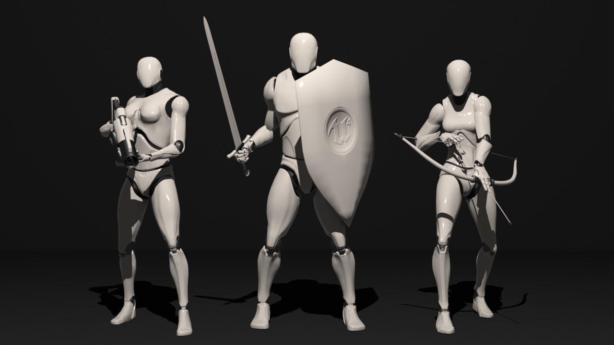

# Mr Mannequins Tools

**Mr Mannequins Tools is a [Blender](https://www.blender.org/) add-on that exports animations and weighted meshes that are directly compatible with the third person mannequin in Unreal Engine, without re-targeting anything... As if that wasn't useful enough, it also has several mannequin themed template meshes and armatures that are ready for you to animate and block out your projects with!**

*This is a free project so please do not anticipate dedicated individual help unless you are supporting me finanically. I will help where i can but only when i have the time.*

Mr Mannequins Tools is what it is, tools for working with the UE4 mannequin from Blender. You can import mannequin animations/meshes, edit them and send them straight back to where they came from as smoothly as possible given Blenders FBX export script is a little... hacky. As of update 1.4.0 i have refactored Mr Mannequins Tools into being purely animation ready mannequin templates and my own import/export logic. 

Mr Mannequins Tools includes several of the add-ons from my [B.L.E.N.D](https://github.com/Jim-Kroovy/B.L.E.N.D) add-on collection. All the rigging, animation retargeting and other bits and bobs that were originally included have been removed, improved, tested by professionals and compiled into their own add-ons, this way they can be more available to all Blenderers. (Aaand Mr Mannequins is no longer too big for me to easily make changes/fixes/updates).

Everything in Mr Mannequins Tools should work fine with [Send To Unreal](https://github.com/EpicGames/BlenderTools) now that it supports any scene unit scale. I still find Mr Mannequins pipeline is about 2-3 times faster so i will always keep my export code updated with Blenders future releases and may continue to implement improvements.

I do not and will never support UE to Rigify as i would rather dig out my spleen with a rusty spoon than use a rigging add-on that i did not code myself... So please stop bugging me about Rigify, Auto Rig Pro, Rokoko and any other add-ons... Too many people keep asking me for help with them... i've tried them all and they are good but do not meet my standards or work for most of my use cases. It is not my problem if other add-ons do not work with mine. 

If you have more general Blender + UE questions and issues feel free to join [Mr Mannequins Discord Server](https://discord.gg/wkPZJaH) to ask me and some of the experienced users of the add-on for help with Blender and Unreal Engine!

You can also find the contents of this readme on the [UE4 Forum Post](https://forums.unrealengine.com/community/community-content-tools-and-tutorials/1661319-mannequin-compatible-animations-and-meshes-blender-to-ue4-free-addon-mr-mannequins-tools-1-1) go like it! (I'm not really very active on the UE forums though)

*I don't expect you to read everything in this readme so here are the contents.*

1. **Support Development:** Promotion for financial support because i put many hours into development every week.
2. **Installation:** A little explanation of downloading and installing because i don't want to have to use LFS.
3. **Contributing, Bugs and Requests:** Some rules for contributions if by some miracle anybody wants to help out.
4. **License Overview:** The licensing overview section that you should probably read.
5. **Add-on Features:** The list and tasks of currently stable add-ons features.

*Here are some further notes about me and this project*

- **Want to get to know me a little?** Hello i'm Jim and i have been working with Blender and UE4 since 2014 and Python since 2018 and i have learned many little tricks and become very familiar with almost every aspect of the Blender API and UE4 Blueprints. I thoroughly enjoy writing Python and i can easily spend 12-16 hours a day working in Blender on add-ons if i get the chance. So far i haven't found anything i can't do in Unreal Engine and i pride myself on the game logic i'm capable of producing. I'm strongest with Armatures and Rigging and weakest with Materials and Lighting.

- **Please report bugs!** As long as it's not a bug involving other add-ons i will probably take a look at it. See section 4.

- **Request new add-ons and features!** I'm always looking for ideas both big and small and it's fun making making mannequin themed templates! See section 4.

- **This is an ongoing project!** I will continue to update and improve all the code and templates as i myself learn and advance my Blender and Python abilities.

- **Let there be guides!** You can find both written and video guides for Mr Mannequins Tools below in the features section. See section 5.

## 1 - Support Development
*Please consider supporting financially! More help means more time i can put into updates, new features and support*

- Donate to the add-on on [Gumroad](https://gumroad.com/jimkroovy)
- Purchase on [Blender Market](https://blendermarket.com/products/mr-mannequins-tools) - Gives the Blender Foundation 10% of profits.
- Support me on [Patreon](https://patreon.com/JimKroovy) - Gives you higher priority in my discord server for feedback, ideas and support.

If you want to stay up to date on what i'm working on you can also subscribe/follow me on:
- [Youtube](https://www.youtube.com/c/JimKroovy) 
- [Twitter](https://twitter.com/JimKroovy) 
- [Facebook](https://www.facebook.com/JimKroovy/) 
- [Instagram](https://www.instagram.com/jimkroovy/)

## 2 - Installation
*For the most part this is pretty straight forward... but just incase*

- Download the latest add-on .zip from the releases section or Gumroad.
- Remove all previous versions of Mr Mannequins Tools, Armature Rigging Library and Armature Deform Controls
- Installing an add-on to Blender is as simple as Edit > Preferences > Add-ons > Install > Navigate to the .zip file > Install Add-on.
- If you want to clone and work with the repo locally you will need to extract any/all resources folders and their contents from the .zip files and then paste them into you local repo.

I'll add an instructional video here when i get the time.

## 3 - Contributing, Bugs and Requests
*I might need to have a few rules to keep me sane if people show an interest*

**Contributing:**
- All pull requests must be well described and their code must be well commented or i won't even look at them before they get rejected. *(time is money)*
- It's fine to put an "i fixed/added this" comment in the code, i'll leave it there, but credit will not be given anywhere else. *(i had to check/edit it anyway)*
- I will not be accepting anything other than scripts that do not conflict with the GPL license that all the Python falls under. *(obviously...)*

**Bugs:**
- All bug issues must use the bug template. *(i need the basic information)*
- Please check it's not already a bug before making it one. *(it's better if more people chime in on the same issues)*
- Please also check to see if any of my guides can solve the issue. *(Many people ask questions i've answered already)*
- See if you can find the answer from an internet search or a written/video guide. *(i'm not a private tutor)*

**Requests:**
- All request issues must use the request template. *(like the bugs, i need the basics presented well)*
- Please check it's not already in the issues before making it. *(more input = better results)*
- Nothing too ridiculous, i'm up for a challenge but there are limitations. *(i'm not doing custom Blender builds lol)*

## 4 - License Overview
*The boring stuff i need to keep myself and my creations safe*

**GNU GPL 3.0**
- All Python scripts used in Blender add-ons must have a GNU GPL compatible license. All the python scripting in the add-on(s) have a GNU GPL 3.0 License.
- See [Sharing or selling Blender add-ons (Python scripts)](https://www.blender.org/about/license/) and [GNU GPL - 3.0](https://www.gnu.org/licenses/gpl-3.0.en.html)
- "Blender’s Python API is an integral part of the software, used to define the user interface or develop tools for example. The GNU GPL license therefore requires that such scripts (if published) are being shared under a GPL compatible license. You are free to sell such scripts, but the sales then is restricted to the download service itself. Your customers will receive the script under the same license (GPL), with the same free conditions as everyone has for Blender."
- So you can do anything you like with my Python scripts but credit is greatly appreciated.

**UE4 EULA**
- All the third person mannequin and first person gun meshes and textures and anything created with them should come under the UE4 EULA. (Unreal Engine - End User License Agreement) 
- See the [Unreal Engine End User License Agreement](https://www.unrealengine.com/en-US/eula)
- The basic idea is that you can use the mannequins/first person gun however you want as long as it's use is related to Unreal Engine.
- There is little point including the UE4 EULA as text with the add-on as you should already have a copy of it if you plan on using this add-on.
- Credit to Jim Kroovy and Mr Mannequins Tools for the Blender side rigging and materials is appreciated but not required under the CC BY license.

**CC BY 4.0**
- All .blend files and their mesh, armature, material and texture contents (provided they do not come under the above UE4 EULA) and anything created with them have a CC-BY license. (Creative Commons - Attribution) 
- See [Creative Commons - CC BY](https://creativecommons.org/licenses/by/4.0/)
- "All CC licenses require that others who use your work in any way must give you credit the way you request, but not in a way that suggests you endorse them or their use. If they want to use your work without giving you credit or for endorsement purposes, they must get your permission first."
- "This license allows reusers to distribute, remix, adapt, and build upon the material in any medium or format, so long as attribution is given to the creator. The license allows for commercial use."
- *Attribution conditions*
  - Do whatever you want with the .blend files and their contents but if you upload or distribute them (or any derivatives of them) you must give me credit. 
  - If you need special permissions please ask. I frequently give special permission for people using my products to create online storefront assets. For example the UE4 Marketplace or Blender Market might require me to alter permissions so that while the creator must credit me in the asset(s) people who purchase the created asset(s) do not have to. That being said i still reserve my right to decline special permissions requests. 
  - To give credit you must visibly state that the specific file(s) or add-on was created by Jim Kroovy and (if possible) provide links to my [Patreon](https://www.patreon.com/JimKroovy) and/or [YouTube Channel](https://www.youtube.com/c/JimKroovy) and/or [Gumroad](https://gumroad.com/jimkroovy). 

**By downloading any/all of these files you agree to the above licenses where applicable!**

## 5 - Add-on Features
*Below are the current/planned features for the add-ons*

**They Aren't Bugs... Just "Features"**
- *There are some limitations...*
- *These are known issues that i may or may not be able to fix*
- Issues:
    - Epics Female Mannequin has slightly offset wrist meshes (I could fix this but it's how she is in engine and it's not my job)
    - Mr Mannequins should automatically install/enable two B.L.E.N.D add-ons 3 seconds after being enabled, they don't get disabled when Mr Mannequins is. (These add-ons probably should not be installed seperately)
    - When loading Mannequin templates, if scaled to scene they randomly have their ankle controls switch direction (It's rare and i can't replicate it, so i don't know how to fix it yet)

**Default Character & Equipment Templates** 
- *View 3D > Add > Mr Mannequins Template*
- The default Meshes, Materials and Armatures from Unreal Engines template projects.
- Contents:
    - [x] Mannequin
    - [x] First Person Gun
    - [x] Female Mannequin
    - [ ] Skysphere?
    - [ ] Statics?

**Custom Character & Equipment Templates** 
- *View 3D > Add > Mr Mannequins Template*
- The mannequin themed Meshes, Materials and Armatures that i will be creating. (Not added in any specific order)
- Contents:
    - [x] Femmequin (My Female Mannequin)
    - [ ] Teenequin (Teenage Mannequins)
    - [ ] Kiddequin (Child Mannequin)
    - [ ] Babequin (Baby Mannequin)
    - [x] Bow and Arrow
    - [x] 1h Sword and Shield
    - [ ] Quiver, Sheath and Backpack
    - [ ] 2h Sword and Pistol
    - [ ] Armour and Clothing
    - [ ] Equinequin (Horse)
    - [ ] Avianequin (Bird)
    - [ ] Caninequin (Dog)
    - [ ] Felinequin (Cat)
    - [ ] Piscinequin (Fish)
    - [ ] Draconequin (Dragon)
    - [ ] Improved Humanoid Characters (New mannequins with face rigging and non-robotic joints)
    - [ ] Dismemberment and Character Creation systems?
    - [ ] Weapon and equipment variety?

**FBX Export Script**
- *File > Export > Mr Mannequins FBX*
- My FBX export scripts that neatly handles scaling, object selection and various other hassles.
- Tasks:
    - [x] Export scaling from any scene unit scale
    - [x] Support export of NLA stack animations
    - [x] Option to assign selected objects into Send 2 Unreals collections
    - [x] Remove need to save before exporting
    - [x] Export static meshes
    - [x] User defined FBX naming conventions
    - [ ] Options to use Send 2 Unreals export operator
    - [ ] Advanced object specific export method
    - [ ] Support for static collision bodies
    - [ ] Support for levels of detail

**FBX Import Script**
- *File > Import > Mr Mannequins FBX*
- My FBX import script that handles scaling and optionally bakes animation to applicable armature controls.
- Tasks:
    - [x] Imported object scaling to any scene unit scale
    - [x] Imported animation playhead scaled to current framerate
    - [x] Option to apply location, rotation and scale on import
    - [ ] Add mesh retargeting on import
    - [ ] Improve baking animations to existing armature controls on import